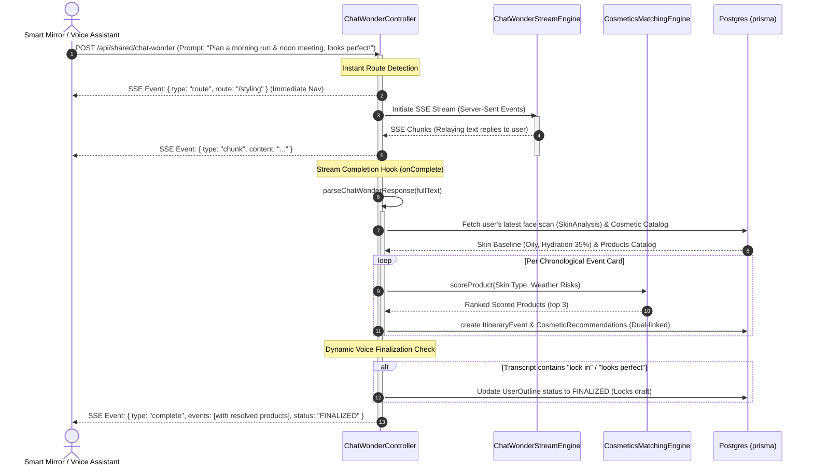

# Chat Wonder daily Itinerary & Cosmetics Flow: Architectural Evaluation

This report evaluates the complete **streamed daily itinerary planning, skin-type cosmetic matching, and dynamic session drafting process** within the Mirror API (`POST /api/shared/chat-wonder`).

---

## 🗺️ Architectural Workflow & Request Lifecycle

The Chat Wonder planning flow acts as the primary cognitive bridge between the physical kiosk (facial scans and vocal transcripts) and the companion app (swipeable itinerary cards and locked travel summaries).



---

## 🔎 The 8-Step Process Breakdown

### Step 1: SSE Handshake & Connection Buffering
When a client hits `POST /api/shared/chat-wonder`, the controller instantly opens a Server-Sent Events (SSE) connection by configuring the headers:
```typescript
res.setHeader("Content-Type", "text/event-stream");
res.setHeader("Cache-Control", "no-cache, no-transform");
res.setHeader("Connection", "keep-alive");
```
This enables real-time text streaming without the overhead of WebSockets.

### Step 2: Instant Navigation Routing
Before any AI response is generated, the controller runs the prompt through `detectChatRoute(input)`. If the user has expressed routing intent (e.g., *"show me outfits"* or *"run skin analysis"*), the controller **immediately emits a `{ type: "route" }` event**. This allows the mirror frontend to transition pages instantly while the AI is still processing the prompt in the background.

### Step 3: Stream Chunk Relay
As the external Chat Wonder API streams tokens, the controller intercepts them via the `onChunk` callback and relays them immediately down the connection.

### Step 4: Stream Cleanup & Parsing
Upon completion (`onComplete`), the raw text stream is cleaned up by stripping source metadata and parsed into a structured JSON structure containing:
* **The conversational response**
* **Chronological daily events** (e.g., `jog`, `meeting`, `date`)
* **Situtional weather risks** (e.g., `oilRisk`, `uvRisk`, `sweatRisk`) and location parameters.

### Step 5: Skin Analysis Retrieval & Catalog Hydration
The controller resolves the active user's **latest face scan** (`SkinAnalysis`) and pulls the core database cosmetics catalog. If the user has never performed a face scan, the engine automatically defaults to a safe skin baseline (`NORMAL` skin type, 50% hydration/oiliness).

### Step 6: Scoring Engine Execution
For each daily event card, our pure rule engine `rankProducts` processes the user's skin concerns against the situational weather risks (e.g., high UV risk triggers waterproof sunscreen boosts; high smudge risk triggers transfer-proof foundation boosts).

### Step 7: Chronological Persistency & The Dual-Link Strategy
To prevent database bloating or data collisions:
1. **Transactional Purge:** The script safely wipes older draft itinerary events and recommendations for the active session.
2. **Dual-Link Relations:** New `CosmeticRecommendation` and `Outfit` rows are written, linking **both** to the overall master `UserOutline` (maintaining complete backwards compatibility with older voice routes) and the new specific `ItineraryEvent` card (for swiping UI layouts).

### Step 8: Dynamic Voice Finalization & Complete Event Packet
The controller parses the user's original spoken input for finalization intent keywords:
```typescript
const isFinalization = /(?:save|confirm|finalize|looks? good|perfect|lock in|looks? awesome|looks? perfect)\b/i.test(input);
```
If matched, the `UserOutline` status flips to **`FINALIZED`**, locking the itinerary summary. Finally, a single complete event packet containing the fully resolved physical database product lists is streamed, closing the SSE connection.

---

## 🏆 Key System Strengths

* **Zero-Lag UX Design**: Relaying instant routes before stream generation gives the mirror interface a snappy, premium feel.
* **Core Taxonomy Security**: Keeping database enums frozen strictly to facial skincare and face makeup enums isolates the database from raw crowdsourced dataset pollution.
* **100% Backward-Compatible Relation Design**: Preserving the legacy `userOutlineId` links ensures that voice assistant triggers, calendar syncs, and older queries do not break while supporting dynamic swipeable itinerary cards.
* **Transactional Drafting State**: The draft status (`DRAFT`, `FINALIZED`) protects historical summaries, allowing the user to draft and iterate schedules with the AI safely before committing.

---

## 🛠️ Actionable Future Recommendations

### 1. Address Score Saturation (Soft Clamping)
As observed in our cosmetics evaluation tests, in high-need environmental conditions (e.g., extremely dry skin + dry weather + wrinkles), multiple products accumulate points very rapidly and saturate at a flat **100/100**. This causes a loss of sorting resolution.
* **Recommendation:** Replace the hard ceiling at 80 with a weighted logarithmic decay to maintain distinct product sorting:
  ```typescript
  if (score > 80) {
    score = 80 + (score - 80) * 0.5; // Bounded, but preserves precise ranking sorting!
  }
  ```

### 2. Implement Connection Keep-Alives during DB Writes
The `onComplete` block performs several database lookups, transactional purges, and inserts. Under extreme database load, this synchronous sequence could cause a lag spike where no chunks are sent, causing a timeout in strict proxy servers.
* **Recommendation:** Emit a brief keep-alive ping or loading indicator chunk (e.g., `data: {"type": "resolving_products"}`) right before calling `resolveItineraryCosmetics` to buffer the connection state.
