# Mirror API — System Pattern & Architecture

> Living document. Updated as the system evolves.
> Last updated: 2026-05-23

---

## 1. What Is This System?

The **Mirror API** is the backend brain of a Smart Mirror lifestyle assistant platform. It connects:

- **Mirror Kiosk** (physical smart mirror display)
- **Companion App** (mobile app for the user)
- **Third-Party / Outer Applications** (external integrations via API key)

All three clients talk to the Mirror API, which orchestrates:
- User authentication & sessions
- Wardrobe management (garments & outfits)
- Cosmetics catalog & skin analysis
- Weather snapshot & location context
- AI-powered lifestyle chat (Chat Wonder)
- Virtual try-on (Fashn AI)
- Map & route planning
- Real-time events via WebSocket (Socket.IO)

---

## 2. Route Namespacing

Routes are split into three namespaces, each with its own auth strategy:

| Namespace | Auth | Purpose |
|---|---|---|
| `/api/v1/mirror/*` | JWT (`authenticate`) | Kiosk-side features |
| `/api/v1/remote/*` | JWT (`authenticate`) | Companion app features |
| `/api/v1/external/*` | API Key (`x-api-key` header) | Third-party outer app access |

> **API Key** is configured via the `THIRD_PARTY_API_KEY` env variable and validated in [`api-key.middleware.ts`](file:///c:/Users/devrm/Documents/GitHub/mirror/mirror-api/src/middleware/api-key.middleware.ts).

---

## 3. Chat Wonder — The AI Lifestyle Engine

### 3.1 What It Does

Chat Wonder is the AI conversation layer. The user types a message (e.g. _"I have a date tonight"_) and the API:

1. Looks up or creates a **Conversation** in the DB
2. Fetches a **ChatWonder session ID** (external AI platform, cached 24h in Redis)
3. Saves the **user message** to chat history
4. Builds an **enriched AI prompt** (4-persona system + wardrobe context)
5. **Streams** the AI response back via **Server-Sent Events (SSE)**
6. On completion: parses the JSON, enriches events with DB cosmetic products, emits kiosk socket events, saves the AI reply

### 3.2 Data Flow Diagram

```mermaid
sequenceDiagram
    participant Client as Client (Kiosk / Companion)
    participant API as Mirror API (Controller/Service)
    participant DB as PostgreSQL DB
    participant Cache as Redis
    participant AI as ChatWonder AI (External)

    Client->>API: POST /api/shared/chat-wonder { input, personas, kioskId, conversationId }
    
    rect rgb(40, 40, 40)
    Note over API,DB: 1. Context Gathering
    API->>DB: ensureConversation()
    API->>Cache: generateChatSessionId()
    API->>DB: saveUserMessage(role: USER)
    API->>DB: buildUserContext() (Garments, Outfits, Weather, Cosmetics)
    end

    API->>API: getAdditionalPrompt() (Inject 4-Personas + Context)
    
    rect rgb(40, 40, 40)
    Note over API,AI: 2. AI Streaming
    API->>AI: Connect WebSocket streamChat()
    loop Stream chunks
        AI-->>API: onChunk() (partial text)
        API-->>Client: SSE: { type: "chunk", content: "..." }
    end
    end

    rect rgb(40, 40, 40)
    Note over API,DB: 3. Completion & Real-Time Sync
    AI-->>API: onComplete() (Full JSON string)
    API->>API: parseChatWonderResponse()
    API->>DB: resolveItineraryCosmetics() (Match AI tags to DB products)
    
    opt If input contains "save / confirm / finalize" and kioskId is provided
        API->>DB: update UserOutline (status: FINALIZED)
        API-->>Client: Socket.IO: emit "itinerary_locked" (to kiosk:<kioskId> room)
    end
    
    API->>DB: saveAIMessage(role: AI)
    API-->>Client: SSE: { type: "complete", message, events, ... }
    end
```



### 3.3 The 4-Persona System

Each chat request can carry a `personas` object to give the AI a distinct personality for each domain:

```json
{
  "input": "I have a date tonight",
  "personas": {
    "system":    "A warm lifestyle concierge",
    "fashion":   "A bold avant-garde fashion designer",
    "cosmetics": "A no-nonsense dermatologist",
    "maps":      "A chill local who knows the scenic route"
  }
}
```

| Persona | Controls | Default Fallback |
|---|---|---|
| `system` | `message` field & general tone | Polite smart mirror assistant |
| `fashion` | `outfit_suggestion` + `events[].fashion` | Knowledgeable fashion stylist |
| `cosmetics` | `cosmetics_suggestion` + `events[].cosmetics` | Professional makeup artist & skincare expert |
| `maps` | `route_suggestion` + `events[].route` | Helpful local guide |

All 4 fields are optional — defaults kick in automatically.

### 3.4 Wardrobe & Weather Context Injection

Before prompting the AI, the API fetches real user data and injects it into the system prompt:

| Data | Source | Limit |
|---|---|---|
| Garments | `Garment` table filtered by `userId` | Up to 20 |
| Saved outfits | `Outfit` table filtered by `userId` | Up to 5 |
| Weather snapshot | `WeatherSnapshot` via `UserOutline.conversationId` | Current outline only |
| Cosmetics | `CosmeticRecommendation` via `UserOutline` (ranked) | Up to 10 |

The AI prompt then looks like:

```
[USER WARDROBE & CONTEXT]
IMPORTANT: Base fashion suggestions on the garments and outfits listed below.

Garments in wardrobe:
- Black Oversized Hoodie [Hoodie] | Category: Streetwear | Silhouette: Oversized
- Blue Slim Jeans [Jeans] | Category: Casual | Silhouette: Slim

Saved outfits:
- "Date Night": Black Oversized Hoodie + Blue Slim Jeans

Recommended cosmetics for this user:
- MAC Ruby Woo by MAC [LIPSTICK, MATTE finish, waterproof]

[CURRENT WEATHER]
Temperature: 32°C | Humidity: 80% | UV Index: 9 | Condition: HOT_HUMID
```

### 3.5 AI Response JSON Schema

The AI always responds with **ONLY VALID JSON** (no markdown):

```json
{
  "message": "Your lifestyle response here",
  "outfit_suggestion": "...",
  "mood": "happy | chill | confident | ...",
  "cosmetics_suggestion": "...",
  "route_suggestion": "...",
  "events": [
    {
      "type": "jog | meeting | date",
      "timeBlock": "morning | afternoon | noon",
      "context": {
        "oilRisk": 0,
        "drynessRisk": 0,
        "uvRisk": 0,
        "smudgeRisk": 0,
        "sweatRisk": 0,
        "tags": ["sunny", "hot"]
      },
      "fashion": {
        "suggestion": "...",
        "tags": ["streetwear", "casual"]
      },
      "cosmetics": {
        "suggestion": "...",
        "tags": ["waterproof", "matte"]
      },
      "route": {
        "suggestion": "...",
        "origin": "...",
        "destination": "..."
      }
    }
  ]
}
```

---

## 4. Real-Time Events (WebSocket / Socket.IO)

The API uses Socket.IO for kiosk-side real-time events:

| Event | Trigger | Payload |
|---|---|---|
| `itinerary_locked` | User says "save / confirm / finalize" in chat | `{ conversationId }` |
| Kiosk connects | Socket joins room `kiosk:<kioskId>` | — |

The `kioskId` is passed in the chat request body and used to target the correct mirror screen.

---

## 5. Key Files Reference

| File | Role |
|---|---|
| [`chat-wonder.controller.ts`](file:///c:/Users/devrm/Documents/GitHub/mirror/mirror-api/src/controllers/shared/chat-wonder.controller.ts) | Internal (JWT) chat endpoint |
| [`chat-wonder.service.ts`](file:///c:/Users/devrm/Documents/GitHub/mirror/mirror-api/src/services/shared/chat-wonder.service.ts) | Prompt builder, context fetcher, session manager |
| [`chat-wonder-stream.ts`](file:///c:/Users/devrm/Documents/GitHub/mirror/mirror-api/src/utils/chat-wonder-stream.ts) | WebSocket client to external ChatWonder AI |
| [`chat-wonder-cosmetics.util.ts`](file:///c:/Users/devrm/Documents/GitHub/mirror/mirror-api/src/utils/chat-wonder-cosmetics.util.ts) | Matches AI cosmetic tags → DB products |
| [`parse-chatWonder-response.util.ts`](file:///c:/Users/devrm/Documents/GitHub/mirror/mirror-api/src/utils/parse-chatWonder-response.util.ts) | Extracts JSON from raw AI stream output |
| [`socket.util.ts`](file:///c:/Users/devrm/Documents/GitHub/mirror/mirror-api/src/utils/socket.util.ts) | Socket.IO emit helpers |
| [`api-key.middleware.ts`](file:///c:/Users/devrm/Documents/GitHub/mirror/mirror-api/src/middleware/api-key.middleware.ts) | Third-party API key validation |
| [`routes/index.ts`](file:///c:/Users/devrm/Documents/GitHub/mirror/mirror-api/src/routes/index.ts) | Master route registry |

---

## 6. Environment Variables

| Variable | Purpose |
|---|---|
| `CHAT_WONDER_API_URL` | Base URL of the external ChatWonder AI platform |
| `THIRD_PARTY_API_KEY` | Shared secret for external/outer app access |
| `DATABASE_URL` | PostgreSQL connection string |
| `REDIS_URL` | Redis for session ID caching |

---

## 7. Personas & Fashion — Design Intent

The system is designed for a **cosmetics and fashion** Smart Mirror. The 4-persona split was chosen so that:

- A user standing in front of the mirror gets **fashion advice in the voice of a stylist**
- **Skincare/makeup** advice from a dermatologist or beauty expert
- **Route/map** guidance from a local navigator
- The **system message** from a warm, consistent assistant personality

This gives the mirror a "team of experts" feel rather than a single generic chatbot.

---

> This document is the source of truth for the Chat Wonder flow and API design.
> Update it whenever the prompt schema, personas, routes, or context injection logic changes.

