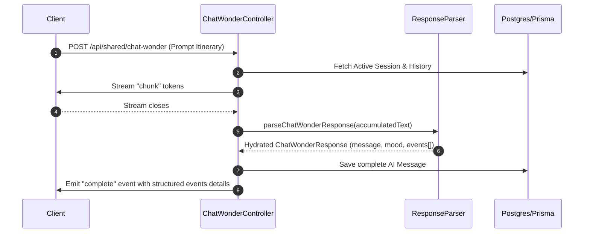

# 🌦️ Context-Aware Styling & Cosmetics Flow — Integration Status

This document tracks the readiness and integration status of the smart mirror's context-aware styling pipeline. This pipeline coordinates **User Prompts**, **Real-Time Weather Snapshots**, **Location & Route Planning**, **Wardrobe Garment Selection**, and **Skincare/Cosmetic Recommendations** into a single cohesive experience.

---

## 🚦 System Integration Dashboard

| Component / Boundary | Ready? | Files & Locations | Current Status |
| :--- | :---: | :--- | :--- |
| **💬 Chat & Itinerary Parsing** | **🟢 YES** | [chat-wonder.service.ts](file:///c:/Users/devrm/Documents/GitHub/mirror/mirror-api/src/services/shared/chat-wonder.service.ts) <br> [parse-chatWonder-response.util.ts](file:///c:/Users/devrm/Documents/GitHub/mirror/mirror-api/src/utils/parse-chatWonder-response.util.ts) | Parses prompts, extracts styling message, outfit description, `mood`, and **structured multi-plan `events`**. |
| **🌦️ Weather Snapshots & Risks** | **🟢 YES** | [weather.util.ts](file:///c:/Users/devrm/Documents/GitHub/mirror/mirror-api/src/utils/weather.util.ts) <br> `prisma/schema.prisma` | Computes derived risks: `oilRisk`, `drynessRisk`, `uvRisk`, `smudgeRisk`, and `sweatRisk` from temperature, humidity, UV, and rain metrics. |
| **🗺️ Maps & Direction Routes** | **🟢 YES** | [map.controller.ts](file:///c:/Users/devrm/Documents/GitHub/mirror/mirror-api/src/controllers/mirror/map.controller.ts) <br> [map.service.ts](file:///c:/Users/devrm/Documents/GitHub/mirror/mirror-api/src/services/shared/map.service.ts) | Proxies geocoding, route calculations (Mapbox & ORS), and POI venue discovery (Foursquare). |
| **👗 Fashion & Layering Engine** | **🟢 YES** | [evaluate-outfit.util.ts](file:///c:/Users/devrm/Documents/GitHub/mirror/mirror-api/src/utils/openai/evaluate-outfit.util.ts) <br> [outfit.controller.ts](file:///c:/Users/devrm/Documents/GitHub/mirror/mirror-api/src/controllers/shared/outfit.controller.ts) | Selects wardrobe garments, assigns stackable Z-index levels (`LAYER_LEVEL`), and anchors slots (`FITTING_SLOT`). |
| **💄 Cosmetics Rule Engine** | **🟢 YES** | [cosmetics.util.ts](file:///c:/Users/devrm/Documents/GitHub/mirror/mirror-api/src/utils/cosmetics.util.ts) <br> [skin-analysis.service.ts](file:///c:/Users/devrm/Documents/GitHub/mirror/mirror-api/src/services/shared/skin-analysis.service.ts) | Scores skincare & makeup options by aligning user skin concerns directly with the derived weather risks. |
| **🔗 Pipeline Orchestrator** | **🟢 YES** | [chat-wonder.controller.ts](file:///c:/Users/devrm/Documents/GitHub/mirror/mirror-api/src/controllers/shared/chat-wonder.controller.ts) | Coordinates the complete parsed results (`outfit_suggestion`, `cosmetics_suggestion`, `route_suggestion`, and structured `events` list) to the client application in a single streamed completion packet. |

---

## 🔄 Current Implementation Mapping

### 1. What is Already Live (Fully Operational)

* **Skincare ↔ Weather Coordination**: 
  * The Cosmetics Engine (`cosmetics.util.ts`) successfully ingests `WeatherContext` parameters. When the weather changes, skincare matching weights automatically adjust:
    ```typescript
    if ((w.uvRisk ?? 0) >= 60 && product.spf && product.spf >= 30) add("weather_uv", 12, "High UV");
    if ((w.sweatRisk ?? 0) >= 60 && product.waterproof) add("weather_sweat", 8, "Sweat risk");
    ```
* **Multi-Plan Itinerary Parsing (`events`)**: 
  * The parser handles complex transition-based daily prompts (e.g. *"Saturday jogging, then lunch board meeting, then afternoon date"*) and maps them into distinct plan sequences:
    ```typescript
    export interface ChatWonderEvent {
      type: "jog" | "meeting" | "date";
      timeBlock: string;
      context: WeatherContext;
      fashion: OutfitPlan;
      cosmetics: CosmeticPlan;
      route: RoutePlan;
    }
    ```
* **AI Wardrobe Composition**: 
  * The styling service (`composeOutfitFromWardrobe`) interprets user text prompts (e.g. *"Dressing for a rainy run"*) and extracts valid matching items from the user's registered wardrobe.
* **Map & POI Routing**: 
  * The map services are fully capable of routing journeys across multiple transit profiles (driving, walking, cycling) while matching venue photos for the target coordinates.

---

## 🚀 The Coordination Blueprint

To support a seamless, end-to-end user scenario in a single interaction, the client issues a natural language plan, and the AI resolves the sequential transition card coordinates directly.

### Unified Integration Flow: `POST /api/shared/chat-wonder`

The user sends their schedule:
```json
{
  "userId": "usr_123",
  "input": "i have a plan on saturday in the morning ill go jogging then lunch with the boards is like a board meeting then afternoon a date with my girlfriends"
}
```

The server streams the response, culminating in a `complete` payload containing the chronological structured segments:



---

## 🛠️ Step-by-Step Action Plan for Front-End Cards Integration

- [x] **1. Add Events parsing support on the Backend**
  * Added `OutfitPlan`, `CosmeticPlan`, `RoutePlan`, and `ChatWonderEvent` definitions in `src/utils/parse-chatWonder-response.util.ts`.
- [x] **2. Update AI prompt metadata**
  * Prompt templates guide `gpt-4o` to output `events` lists with weather context risks, travel suggestions, fashion plans, and skincare/cosmetics plans.
- [x] **3. Stream structured events in completion payload**
  * Configured `chat-wonder.controller.ts` to output `events: parsed.events` to the client.
- [ ] **4. Build the Transition Cards UI (Frontend)**
  * Update `mirror-app` / `companion-app` to check if `events` are present on the `complete` SSE event.
  * Render three horizontal swipeable blocks:
    * **Card 1: Active** — Jogging activewear suggestions + sweatproof SPF moisturizer + park trail directions.
    * **Card 2: Professional** — Business casual suit suggestions + matte oil-control cosmetics + office driving routes.
    * **Card 3: Romantic** — Date flowy dress + dewy finish makeup + restaurant walking directions.
