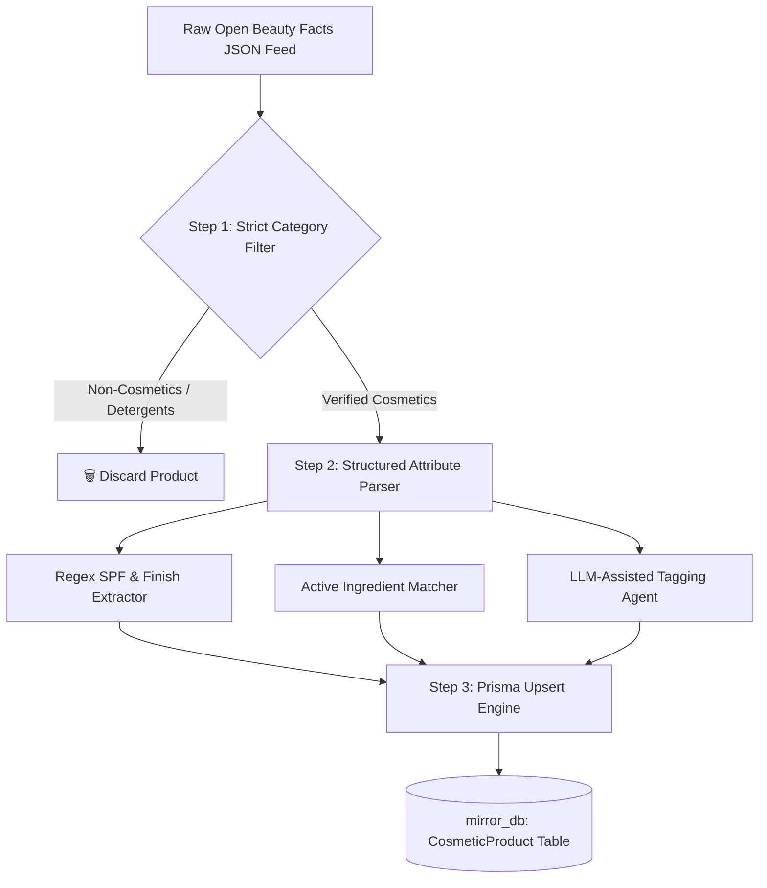

# 💄 Open Beauty Facts Ingestion Pipeline

> **Status: Implemented**
> The ingestor script is located at `src/scripts/import-openbeautyfacts.ts`.
> Run it via: `npx ts-node src/scripts/import-openbeautyfacts.ts <path_to_json_file>`

This document outlines the architecture and parsing rules used by our ingestion pipeline to convert raw product JSON data from **Open Beauty Facts** into a clean, rich, and highly reliable catalog for the **Mirror Cosmetics Recommendation Engine** (`src/utils/cosmetics.util.ts`).

---

## 🔍 Critical Analysis of Raw Open Beauty Facts Data

Based on the raw sample provided (e.g., barcode `3178041358996`), here is a breakdown of what the raw Open Beauty Facts dataset provides and where it falls short for our advanced skin-type & weather-matching engine.

### 1. What the Raw Data Provides (The Strengths)
* **Metadata & Identifiers**: Barcode/UPC (`code`), product page (`url`), creation/modification timestamps, and manufacturers/brands (`brands`).
* **Basic Text Info**: Brand strings (`brands_en`), product name (`product_name`), packaging details (`packaging`), and volume/weight (`quantity`: e.g., `"715mle"`).
* **Media Assets**: `image_url` and `image_small_url` (direct links to physical packaging images hosted on Open Beauty Facts CDN).
* **Unstructured Ingredients**: Although not showing in this specific sample, Open Beauty Facts records typically include `ingredients_text` (raw string block of ingredients) and `ingredients_tags` (machine-generated language codes).

### 2. Why the Raw Data is NOT Enough Out-of-the-Box (The Gaps)
The Mirror Recommendation Engine relies on a **strict, structured rule matrix** mapped to Prisma schemas. Using Open Beauty Facts raw data directly introduces several critical blockers:

* **🚨 Severe Data Noise (Non-Cosmetic Products)**:
  * The sample product provided is **"mir raviveur laine"** by Henkel. This is a **wool detergent/laundry liquid**, not skincare or makeup!
  * Because Open Beauty Facts utilizes crowdsourced, wiki-style submissions, it contains laundry soaps, hair styling products, household cleaners, and highly generalized personal hygiene items. Ingesting this raw feed unfiltered will fill our styling interface with laundry detergents.
* **❌ Complete Absence of Engine-Critical Matching Fields**:
  * Our `rankProducts` engine uses specific columns to calculate weather, skin type, and concern scores. None of these exist in the raw Open Beauty Facts JSON:
    * `category` (`COSMETIC_CATEGORY` enum: `FACE`, `EYES`, `LIPS`, `SKINCARE`)
    * `type` (`COSMETIC_TYPE` enum: `SUNSCREEN`, `MOISTURIZER`, `SERUM`, `TONER`, etc.)
    * `spf` (Int)
    * `waterproof`, `transferProof`, `hydrating`, `oilFree` (Booleans)
    * `finish` (`COSMETIC_FINISH` enum: `MATTE`, `DEWY`, `NATURAL`)
* **🧩 Unstructured Ingredients vs. Active Ingredient Tags**:
  * Our engine checks `CosmeticProduct.tags` for specific **active ingredients** (e.g., `"niacinamide"`, `"salicylic acid"`, `"ceramide"`, `"retinol"`, `"vitamin c"`) to award concern-matching bonuses (+10 points).
  * Raw Open Beauty Facts ingredients are raw comma-separated text blocks in multiple languages that cannot be matched cleanly by the database without extraction.

---

## 🗺️ Prisma Schema Mapping Matrix

Here is how we must transform and map the raw Open Beauty Facts JSON properties to fit into our high-performance `CosmeticProduct` PostgreSQL table.

| Mirror Prisma Field | Type / Enum | Source in Open Beauty Facts JSON | Transformation & Extraction Rule Required |
| :--- | :--- | :--- | :--- |
| **`id`** | `String` (PK) | `code` (e.g. `3178041358996`) | Stringify standard long barcode or fallback to CUID if missing. |
| **`name`** | `String` | `product_name` | Capitalize and clean up names (e.g. remove brand duplicates). |
| **`brand`** | `String` (Nullable) | `brands_en` / `brands` | Pick first brand or primary brand name. |
| **`details`** | `String` (Nullable) | `generic_name` / `packaging` | Map simple description tags or fallback to packaging text. |
| **`fileUrlId`** | `String` (FK) | `image_url` | Create associated `File` record linked to CDN URL, save ID. |
| **`category`** | `COSMETIC_CATEGORY` | `categories_tags` / *Computed* | **Computed**: Map to `FACE`, `EYES`, `LIPS`, or `SKINCARE` based on product sub-types. |
| **`type`** | `COSMETIC_TYPE` | `categories_tags` / *Computed* | **Computed**: Classify into enum (e.g. `SUNSCREEN`, `MOISTURIZER`). |
| **`spf`** | `Int` (Nullable) | `product_name` / *Computed* | **Computed**: Use regex to extract numbers from product name matching `SPF\s*(\d+)`. |
| **`waterproof`** | `Boolean` | `product_name` / *Computed* | **Computed**: Set to `true` if name or keywords match `waterproof` / `résistant à l'eau`. |
| **`transferProof`**| `Boolean` | `product_name` / *Computed* | **Computed**: Set to `true` if name/description contains `transferproof` / `sans transfert`. |
| **`hydrating`** | `Boolean` | `product_name` / *Computed* | **Computed**: Set to `true` if name/description contains `hydrating` / `moisturizing` / `hydratant`. |
| **`oilFree`** | `Boolean` | `product_name` / *Computed* | **Computed**: Set to `true` if label/ingredients match `oil-free` / `sans huile` / `non-comedogenic`. |
| **`finish`** | `COSMETIC_FINISH` | `product_name` / *Computed* | **Computed**: Regex match for finish keywords: `matte` ➔ `MATTE`, `dewy` / `glow` ➔ `DEWY`, `natural` ➔ `NATURAL`. |
| **`tags`** | `String[]` | `ingredients_text` / *Computed* | **Computed**: Extract active ingredients from raw text to match exact rule tags. |

---

## 🛠️ The Ingestion Pipeline (`import-openbeautyfacts.ts`)

The implemented ingestion pipeline consists of three layers: **Filter**, **Enrich**, and **Upsert**.



### Step 1: Strict Category Filtering
To avoid detergent products, we should check `categories_tags` or `categories_hierarchy` in the Open Beauty Facts feed.
* **Keep**: If categories contain words like `makeup`, `skin-care`, `creams`, `sunscreens`, `lipsticks`, `face`, `eyes`, `lips`.
* **Discard**: If categories contain `laundry`, `household`, `detergent`, `hair-styling`, `home-care`.

### Step 2: Advanced Metadata Extraction Rules

To map the unstructured strings to our database schema, we can write a simple but highly effective TypeScript extraction script:

```typescript
// Example parsing logic for a raw product
export function enrichProductData(raw: any) {
  const name = raw.product_name || "";
  const nameLower = name.toLowerCase();
  
  // 1. Extract SPF
  let spf: number | null = null;
  const spfMatch = name.match(/spf\s*(\d+)/i);
  if (spfMatch) {
    spf = parseInt(spfMatch[1], 10);
  }

  // 2. Extract Finish
  let finish: "MATTE" | "DEWY" | "NATURAL" | null = null;
  if (/matte|anti-shine|poreless|matifiant/i.test(nameLower)) finish = "MATTE";
  else if (/dewy|glow|radiant|hydra-glow/i.test(nameLower)) finish = "DEWY";
  else if (/natural|invisible|sheer/i.test(nameLower)) finish = "NATURAL";

  // 3. Extracted Active Ingredients (Tags)
  const ingredientsRaw = raw.ingredients_text || "";
  const ingredientsLower = ingredientsRaw.toLowerCase();
  const activeTags: string[] = [];
  
  const targetIngredients = [
    "niacinamide", "salicylic acid", "retinol", "ceramide", 
    "hyaluronic acid", "zinc oxide", "vitamin c", "centella", 
    "oatmeal", "glycolic acid", "peptide", "snail secretion"
  ];
  
  for (const ingredient of targetIngredients) {
    if (ingredientsLower.includes(ingredient) || nameLower.includes(ingredient)) {
      activeTags.push(ingredient);
    }
  }

  // 4. Boolean Flags
  const hydrating = /hydrat|moistur|water-rich/i.test(nameLower) || activeTags.includes("hyaluronic acid");
  const oilFree = /oil-free|non-comedogenic|sans huile|sebum-control/i.test(nameLower) || activeTags.includes("salicylic acid");
  const waterproof = /waterproof|water-resistant|résistant à l'eau/i.test(nameLower);

  return {
    spf,
    finish,
    tags: activeTags,
    hydrating,
    oilFree,
    waterproof
  };
}
```

### Step 3: LLM-Assisted Classification (For High-Fidelity Catalogs)
For products that have ambiguous names, we can feed the product JSON to a lightweight LLM using **structured JSON outputs**:
> **System Prompt**: "You are a skincare database classifier. Given this product JSON, extract the category, type, finish, active ingredients, and boolean properties matching our schema."

---

## 🎯 Summary of What You Need
To fully operationalize this raw data, you need to:
1. **Filter out non-skincare/makeup items** using category inclusion lists.
2. **Apply the attribute parser** (regex and keyword matcher shown above) to extract `spf`, `finish`, `waterproof`, `hydrating`, `oilFree`, and active ingredient `tags`.
3. **Write the parsed fields directly into `CosmeticProduct`** to empower our weather and skin-type rule scoring engine.
